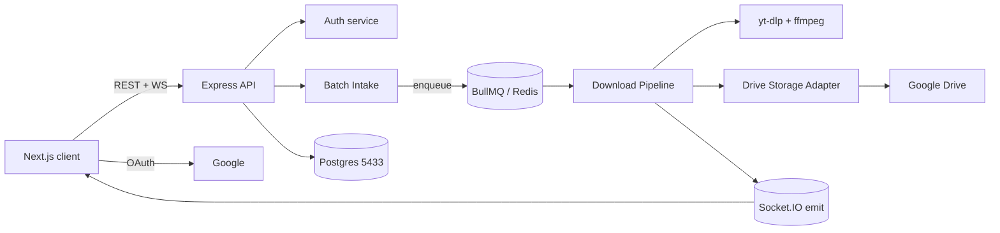

# Video Footage Downloader

[](backend)
[](frontend)
[](LICENSE)

Batch video downloader (TikTok / YouTube) with frame-accurate trimming and automatic
upload to Google Drive. Submit links, pick a segment by timestamp, and the footage lands in
your project's Drive folder — progress streams live over WebSockets.

## Features

- **Batch intake** — submit up to 50 links per batch (full download or timestamp trim).
- **Frame-accurate trimming** — yt-dlp keyframe pass with ffmpeg offset re-trim fallback.
- **Google Drive** — OAuth connect, encrypted token storage, automatic access-token refresh.
- **Realtime** — Socket.IO pushes `job:progress` / `job:done` / `job:failed` / `batch:completed`.
- **Resilience** — server-side auto-retry for transient TikTok errors; queue/cancel/retry from UI.
- **Notifications** — in-app notifications per batch completion.

## Monorepo layout

No root `package.json` — `backend/` and `frontend/` are independent apps. Run every `npm` /
`npx` command from inside the relevant subfolder.

```
footage-downloader/
├── backend/      Express 5 + TS API, workers, Prisma, BullMQ/Redis, Socket.IO
├── frontend/     Next.js 16 (App Router, Tailwind v4) client
├── CONTEXT.md    domain glossary + deep-module seams (source of truth for architecture)
└── AGENTS.md     repo-wide conventions
```

### Architecture



## Tech stack

| Layer      | Stack                                                                                  |
| ---------- | -------------------------------------------------------------------------------------- |
| Backend    | Express 5, TypeScript, Prisma 6, PostgreSQL, BullMQ 6 + Redis, Socket.IO 4, Zod, JWT   |
| Workers    | yt-dlp + ffmpeg invoked as child processes (external binaries, not npm deps)           |
| Frontend   | Next.js 16 (App Router, Tailwind v4 — no `src/), React Query, Zustand, framer-motion    |
| Realtime   | socket.io-client                                                                        |

## Prerequisites

- Node.js LTS
- Docker (for Postgres + Redis)
- `yt-dlp` and `ffmpeg` on `PATH`
- A Google Cloud OAuth client (web) with two redirect URIs:
  - `http://localhost:4000/auth/google/callback`
  - `http://localhost:4000/drive-accounts/connect/callback`

## Backend setup

```bash
cd backend
cp .env.example .env          # then fill in the values below
docker-compose up -d          # Postgres on 5433, Redis on 6380
npx prisma migrate deploy
npm install
npm run dev                   # tsx watch src/server.ts on :4000
```

`.env` values:

- `JWT_SECRET` — random secret
- `ENCRYPTION_KEY` — 32-byte key (hex/base64)
- `GOOGLE_CLIENT_ID` / `GOOGLE_CLIENT_SECRET` — from the OAuth client
- `CORS_ORIGINS` — comma-separated. Add `http://localhost:3000` for the Next dev server.
- `FRONTEND_URL` — `http://localhost:3000` (OAuth post-login redirect)

**TikTok cookies (optional).** Sensitive / age-gated TikTok videos need cookies. Priority:
`TIKTOK_COOKIES_FILE` (path to a Netscape `cookies.txt`, deterministic) > `TIKTOK_COOKIES_BROWSER`
(logged-in browser name, needs it closed + keyring access). Leave blank for public videos.

The cookies file lives in `backend/docs/` which is gitignored — **never committed**.

## Frontend setup

```bash
cd frontend
# .env.local
#   NEXT_PUBLIC_API_URL=http://localhost:4000
#   NEXT_PUBLIC_WS_URL=ws://localhost:4000
npm install
npm run dev                   # Next dev on :3000
```

A Next.js middleware redirects unauthenticated users to `/login` and authenticated users away
from it. Auth state is the JWT in `localStorage` (mirrored to a cookie for the middleware).

## Verify

| App      | Command                       | Notes                                          |
| -------- | ----------------------------- | ---------------------------------------------- |
| backend  | `npm run test:unit`           | 68 tests, `node:test` via tsx, no infra       |
| backend  | `npm run test:api`            | e2e — needs running server + DB + Redis       |
| backend  | `npm run test:socket`         | e2e — realtime events                         |
| backend  | `npm run test:retry`          | e2e — retry / cancel flow                     |
| backend  | `npx tsc --noEmit`            | typecheck (`src/` only)                       |
| frontend | `npm run test`                | vitest — 10 tests (cache mutator + sync adapter) |
| frontend | `npm run lint`                | eslint                                         |
| frontend | `npx tsc --noEmit`            | typecheck                                      |

## Documentation

- `CONTEXT.md` — domain glossary and the deep-module seams (Batch Intake, Download Pipeline,
  Drive Storage Adapter, Job Realtime Sync Adapter, Batch Completion Sentinel).
- `backend/docs/` — PRD, API spec, DB schema, current implementation state.
- `frontend/docs/` — data spec + API reference.

## Gotchas

- **Next.js 16** has breaking changes vs older versions — read `node_modules/next/dist/docs/`.
- **Tailwind v4** is configured via CSS `@theme`, not `tailwind.config.js`.
- Infra runs on **non-default ports** in `docker-compose` (Postgres `5433`, Redis `6380`).
- CORS allowlist is the only one, in `backend/src/config/cors.ts`, read from `CORS_ORIGINS`.
  Default is `http://localhost:5173` (Vite) — add `http://localhost:3000` to dev with Next.
